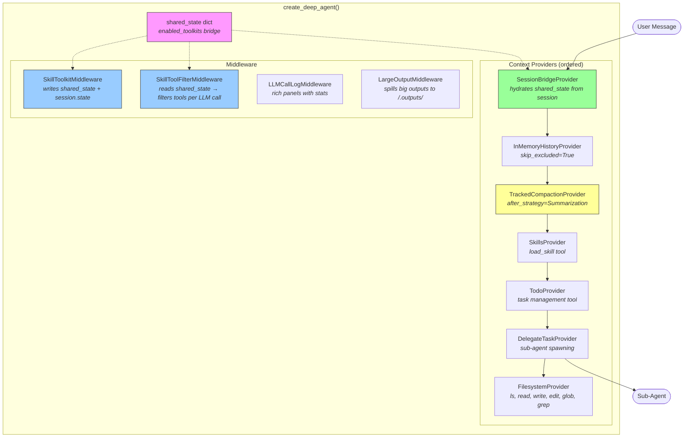
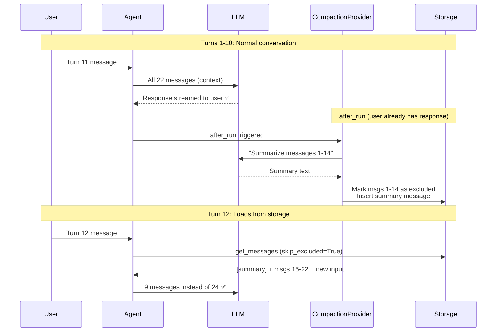
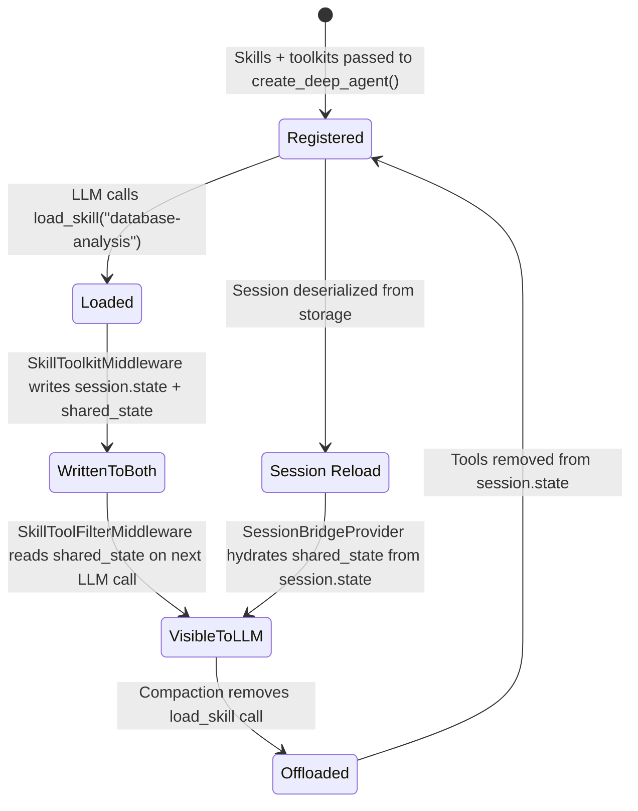
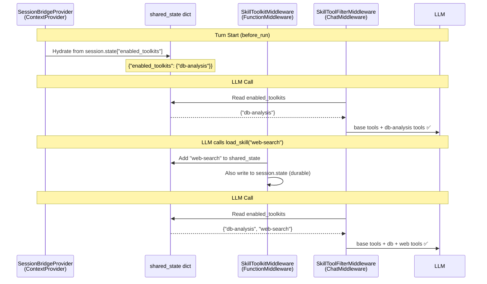
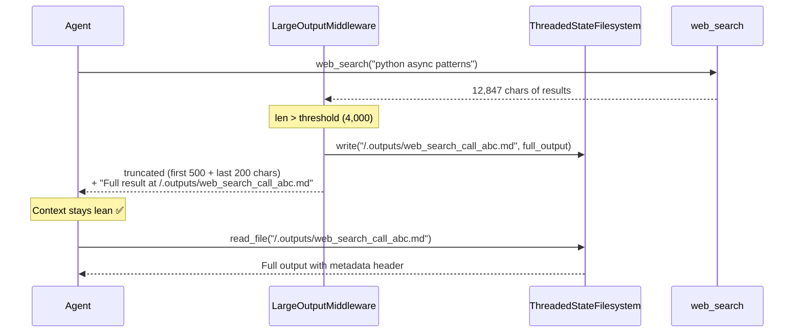

<div align="center">

# 🧠 maf-deep-agent

**Batteries-included agent builder for [Microsoft Agent Framework](https://github.com/microsoft/agent-framework)**

One function call. Production-grade agent with skills, automatic context compaction, task management, sub-agent delegation, and rich terminal logging.

[](https://www.python.org/downloads/)
[](https://github.com/microsoft/agent-framework)
[](LICENSE)
[](https://github.com/psf/black)

`ai-agent` · `llm` · `context-management` · `tool-use` · `agent-framework` · `openai` · `azure-openai` · `multi-agent` · `summarization` · `skills`

</div>

---

## Why maf-deep-agent?

Microsoft's Agent Framework gives you powerful primitives — agents, tools, context providers, middleware. But wiring them together for production means solving the same problems every time:

- ❌ Context windows overflow after a few turns
- ❌ Tools need to be loaded/unloaded dynamically
- ❌ No task tracking across multi-step workflows
- ❌ Sub-agent delegation requires manual plumbing
- ❌ No visibility into what the LLM sees each turn

**maf-deep-agent** solves all of these with a single function:

```python
from deep_agent import create_deep_agent

agent = create_deep_agent(
    client=client,
    instructions="You are a research assistant.",
    skills=my_skills,
    skill_toolkits=my_toolkits,
)
```

You get a standard `Agent` back — works with `run()`, `run_stream()`, DevServer, or any custom server.

---

## Features

| Feature | What it does |
|---------|-------------|
| 🗜️ **Auto Summarization** | Automatically summarizes old messages when context grows too large. Never hit token limits. |
| 🔧 **Skill Lifecycle** | Load/unload tool groups on demand via `load_skill`. Tools appear **same-turn** — no waiting for next turn. |
| 📦 **Toolkit Offloading** | When compaction removes a `load_skill` call, the associated tools are automatically unloaded. |
| 📝 **Task Management** | Built-in `todo` tool for tracking multi-step work within a session. |
| 🚀 **Sub-Agent Delegation** | Spawn focused child agents with `delegate_task` — batch mode, concurrent execution. |
| 📊 **Rich Terminal Logging** | See exactly what goes to the LLM: message counts, token estimates, tool lists, summaries. |
| 📂 **Virtual Filesystem** | Session-scoped in-memory filesystem with `ls`, `read_file`, `write_file`, `edit_file`, `glob`, `grep`. Persists to Azure Blob Storage. |
| 🗂️ **Large Output Spilling** | Tool outputs exceeding a threshold are auto-saved to `/.outputs/` and replaced with a truncated summary + file path. |
| ⚡ **Zero Config** | Sensible defaults. One function call. Standard `Agent` returned. |

---

## Architecture



### How Compaction Works



### Skill Lifecycle — Same-Turn Tool Injection



### The Token Problem — Why Skill Offloading Matters

Every tool sent to the LLM costs tokens in the request schema. A typical function tool definition is **300–800 tokens**. With 20+ tools, you're burning **6,000–16,000 tokens per LLM call** just on tool definitions — before any conversation content.

```
┌─────────────────────────────────────────────────────────────┐
│                  Without Skill Offloading                   │
│                                                             │
│  LLM Call #1:  20 tools × ~500 tokens = 10,000 tokens      │
│  LLM Call #2:  20 tools × ~500 tokens = 10,000 tokens      │
│  LLM Call #3:  20 tools × ~500 tokens = 10,000 tokens      │
│  ...                                                        │
│  10-call session: ~100,000 tokens on tool schemas alone!    │
└─────────────────────────────────────────────────────────────┘

┌─────────────────────────────────────────────────────────────┐
│                  With Skill Offloading                      │
│                                                             │
│  LLM Call #1:  4 base tools  = 2,000 tokens  (no skills)   │
│  LLM Call #2:  4 base + load_skill called                   │
│  LLM Call #3:  4 base + 3 DB tools = 3,500 tokens          │
│  LLM Call #4:  4 base + 3 DB tools = 3,500 tokens          │
│  Compaction:   DB tools offloaded                           │
│  LLM Call #5:  4 base tools  = 2,000 tokens  (clean!)      │
│  ...                                                        │
│  10-call session: ~25,000 tokens — 75% savings!            │
└─────────────────────────────────────────────────────────────┘
```

### How It Works — The Shared State Bridge

The framework's `ChatMiddleware` (which controls what tools the LLM sees per call) has **no access to the session object**. Meanwhile, `FunctionMiddleware` (which intercepts `load_skill`) has full session access but can't modify the tool list.

maf-deep-agent bridges this gap with a **shared mutable dict** — a plain Python object passed by reference to three components:



**Key design decisions:**

| Concern | Solution |
|---------|----------|
| Same-turn availability | `ChatMiddleware` fires per LLM call, not per turn — sees updates immediately |
| Session persistence | `SkillToolkitMiddleware` writes to **both** `session.state` (durable) and `shared_state` (live) |
| Session reload | `SessionBridgeProvider.before_run()` hydrates `shared_state` from `session.state` every turn |
| Mutation safety | `SkillToolFilterMiddleware` always rebuilds from the authoritative `all_tools` list, never from `context.options["tools"]` |
| Concurrency | Single agent instance per session — no concurrent access to shared dict |

### How Skills & Toolkits Work

1. **You register skills and their toolkits** — each skill name maps to a list of tools (e.g. `"web-research" → [tavily_search]`). All tools are registered on the agent at build time so the framework can always execute them, but `SkillToolFilterMiddleware` hides unloaded ones from the LLM.

2. **Tools are NOT sent to the LLM until loaded** — on startup the LLM only sees base tools + `load_skill`. No skill tools are in context. This keeps the initial tool schema small and saves tokens.

3. **LLM calls `load_skill("web-research")`** — `SkillToolkitMiddleware` (FunctionMiddleware) intercepts this, writes `"web-research"` to both `session.state["enabled_toolkits"]` (durable) and the shared dict (live bridge).

4. **On the very next LLM call (same turn!)** — `SkillToolFilterMiddleware` (ChatMiddleware) reads the shared dict, sees `"web-research"` is enabled, and includes `tavily_search` in the tool list sent to the LLM. No need to wait for the next turn.

5. **On every new turn** — `SessionBridgeProvider.before_run()` hydrates the shared dict from `session.state`, ensuring previously loaded skills are visible from the first LLM call.

6. **When context grows too large, compaction summarizes old messages** — if the `load_skill("web-research")` call gets summarized away, `TrackedCompactionProvider` detects it and **automatically removes those tools from the session**. The LLM no longer sees `tavily_search`. Context shrinks.

7. **The skill can be loaded again** — if the LLM needs web search later, it calls `load_skill("web-research")` again. The tools reappear. No state is lost — the skill definition still exists.

**Why this matters:** A typical agent with 20+ tools sends all tool schemas every turn (~500 tokens each). With skill-based loading, you only pay for the tools the LLM is actively using. Compaction-driven offloading means even those tools get cleaned up when they're no longer referenced in the conversation. For a 20-tool agent over a 10-call session, this can save **75%+ of tool schema tokens**.

### Virtual Filesystem & Large Output Spilling

When `enable_filesystem=True`, the agent gains a session-scoped in-memory virtual filesystem and automatic large output management:



**How it works:**

1. **`FilesystemProvider`** injects 6 tools (`ls`, `read_file`, `write_file`, `edit_file`, `glob`, `grep`) scoped to `session.session_id`. Each session sees its own isolated virtual folder. The agent never sees session IDs.

2. **`LargeOutputMiddleware`** runs after every tool call. If the output exceeds `threshold` (default 4,000 chars), it:
   - Writes the full output to `/.outputs/{tool_name}_{call_id}.md` with a metadata header (tool name, call ID, arguments)
   - Replaces the result with head/tail excerpts + the file path
   - The agent can `read_file` the full output on demand

3. **Excluded tools** — filesystem tools themselves (`ls`, `read_file`, etc.) are never spilled, preventing circular writes. Customize via `fs_exclude_tools`:

```python
agent = create_deep_agent(
    client=client,
    instructions="...",
    enable_filesystem=True,
    fs_exclude_tools={"ls", "read_file", "write_file", "edit_file",
                      "glob", "grep", "todo"},  # also exclude todo
)
```

4. **Blob persistence** — the entire virtual filesystem (agent files + spilled outputs) can be saved/restored via Azure Blob Storage at session boundaries:

```python
fs = agent_filesystem  # access the ThreadedStateFilesystem instance

# On session end
await fs.save_to_blob(session.session_id, blob_client)

# On session resume
await fs.load_from_blob(session.session_id, blob_client)
```

**Spilled file format:**

```markdown
# Tool Output: web_search
**Call ID:** call_abc123
**Args:** {"query": "python async patterns", "max_results": 10}
**Length:** 12,847 chars
---
[full tool output here...]
```

---

## Installation

```bash
# From source (editable)
pip install -e ./deep_agent/

# Or with uv
uv pip install -e ./deep_agent/
```

### Requirements

- Python ≥ 3.11
- `agent-framework` ≥ 1.3.0
- `rich` ≥ 13.0
- `python-dotenv` ≥ 1.0

---

## API Reference

### `create_deep_agent(**kwargs) → Agent`

| Parameter | Type | Default | Description |
|-----------|------|---------|-------------|
| `client` | `ChatClient` | *required* | LLM client (OpenAI, Azure, etc.) |
| `instructions` | `str` | *required* | System prompt |
| `name` | `str` | `"maf-deep-agent"` | Agent name |
| `tools` | `list[FunctionTool]` | `None` | Always-on tools (every turn) |
| `skills` | `list[SkillResource]` | `None` | Skills for `load_skill` |
| `skill_toolkits` | `dict[str, list]` | `None` | Mutable mapping: skill name → tools |
| `target_count` | `int` | `8` | Keep N newest messages after summarization |
| `threshold` | `int` | `12` | Trigger when messages > target + threshold |
| `enable_todo` | `bool` | `True` | Include todo tool |
| `enable_delegation` | `bool` | `True` | Include delegate_task tool |
| `enable_logging` | `bool` | `True` | Include rich LLM logging middleware |
| `enable_filesystem` | `bool` | `False` | Include virtual filesystem tools + large output spilling middleware |
| `fs_exclude_tools` | `set[str]` | `None` | Tool names to never spill (defaults to the 6 filesystem tools) |
| `context_providers` | `list` | `None` | Your own providers — appended after built-ins |
| `middleware` | `list` | `None` | Your own middleware — appended after built-ins |

---

## Built-in Tools

| Tool | Description |
|------|-------------|
| `load_skill` | Activate a skill to unlock its tools for the session |
| `todo` | Session-scoped task list — add, update, remove, merge or replace |
| `delegate_task` | Spawn sub-agents for focused work — single or batch (up to 3 concurrent) |
| `ls` | List files/directories in the virtual workspace (requires `enable_filesystem`) |
| `read_file` | Read a file with line numbers and pagination |
| `write_file` | Create a new file (fails if exists) |
| `edit_file` | Edit via exact string replacement |
| `glob` | Find files matching a pattern (`*`, `**`, `?`) |
| `grep` | Search file contents for text |

---

## Custom Providers & Middleware

Pass your own via `extra_context_providers` and `extra_middleware`:

```python
agent = create_deep_agent(
    client=client,
    instructions="...",
    context_providers=[MyRAGProvider()],
    middleware=[MyAuditMiddleware()],
)
```

### Execution Order

The framework calls `before_run` on context providers **in list order**, and `after_run` in **reversed** order. Your extras run last on the way in and first on the way out:

```
before_run order:                after_run order (reversed):
  1. SessionBridgeProvider         8. ← your extras
  2. InMemoryHistoryProvider       7. ← FilesystemProvider (if enabled)
  3. TrackedCompactionProvider     6. ← DelegateTaskProvider
  4. SkillsProvider                5. ← TodoProvider
  5. TodoProvider                  4. ← SkillsProvider
  6. DelegateTaskProvider          3. ← TrackedCompactionProvider
  7. FilesystemProvider (if on)    2. ← InMemoryHistoryProvider
  8. → your extras                 1. ← SessionBridgeProvider
```

Middleware wraps the LLM call as an onion — your extras wrap the outermost layer after the built-in `SkillToolkitMiddleware`, `SkillToolFilterMiddleware`, and `LLMCallLogMiddleware`.

---

## Terminal Output

When `enable_logging=True` (default):

```
CompactionProvider context •  18 msgs, est_tokens: 2,250
╭────────────────────── → LLM Call ───────────────────────╮
│ Messages   19 total (assistant=9 tool=2 user=8)         │
│            ~1,304 est_tokens (5,217 chars)               │
│ Tools      4: load_skill, tavily_search, todo,           │
│            delegate_task                                 │
╰─────────────────────────────────────────────────────────╯
CompactionProvider compacted 🗜️  10 msgs summarized (22→13)
  tokens: 2,497→2,296 (saved 201)
```

---

## Concurrency & WebSockets

The framework is sequential per session — `after_run` completes before `run()` returns. For WebSocket servers, use a per-session lock:

```python
session_locks: dict[str, asyncio.Lock] = {}

async def handle_message(ws, msg, agent, session):
    lock = session_locks.setdefault(session.id, asyncio.Lock())
    async with lock:
        async for event in agent.run_stream(msg, session=session):
            await ws.send_json(event.model_dump())
```

## Sub-Agent Streaming

Sub-agent tokens don't surface through the parent's `run_stream()` — they run inside a tool call which is opaque to the framework. `maf-deep-agent` provides `stream_with_subagents()` which merges parent and sub-agent tokens into a single stream of native `AgentResponseUpdate` objects:

```python
from deep_agent import stream_with_subagents

async for update in stream_with_subagents(agent, "Research AI", session=session):
    # update.author_name distinguishes parent ("maf-deep-agent") vs sub-agent ("python-researcher")
    # update.finish_reason == "stop" means that source is done
    print(f"[{update.author_name}] {update.text}")
```

No custom types — every event is a framework-native `AgentResponseUpdate` with `author_name` set to identify the source. See [docs/SUBAGENT_STREAMING.md](docs/SUBAGENT_STREAMING.md) for the low-level API, FastAPI WebSocket example, and framework caveats.

---

## Comparison

| Capability | Raw Agent Framework | maf-deep-agent |
|-----------|-------------------|------------|
| Context management | Manual | ✅ Auto summarization |
| Tool lifecycle | Manual | ✅ Same-turn load/unload via skills |
| Toolkit offloading | Not built-in | ✅ Auto on compaction |
| Tool token savings | N/A — all tools every call | ✅ 75%+ schema token savings |
| Task tracking | Not built-in | ✅ Built-in todo tool |
| Sub-agent delegation | Manual | ✅ One call with batching |
| Observability | Basic logging | ✅ Rich panels + token counts |
| Virtual filesystem | Not built-in | ✅ Session-scoped, blob-persistent |
| Large output mgmt | Manual | ✅ Auto-spill to FS, agent reads on demand |
| Session reload | Manual | ✅ Skills auto-rehydrated from session state |
| Setup | ~50 lines of wiring | ✅ 1 function call |

---

## Package Structure

```
deep_agent/
├── pyproject.toml
├── README.md
├── .env.example
├── deep_agent/
│   ├── __init__.py                 # create_deep_agent
│   ├── _builder.py                 # factory function + provider/middleware wiring
│   ├── _logging.py                 # rich console, agent_log, icons
│   ├── providers/
│   │   ├── compaction.py           # TrackedCompactionProvider
│   │   ├── session_bridge.py       # SessionBridgeProvider (hydrates shared_state)
│   │   ├── todo.py                 # TodoProvider
│   │   ├── delegate_task.py        # DelegateTaskProvider
│   │   └── filesystem_provider.py  # FilesystemProvider
│   ├── middlewares/
│   │   ├── skill_toolkit.py        # SkillToolkitMiddleware (FunctionMiddleware)
│   │   ├── skill_tool_filter.py    # SkillToolFilterMiddleware (ChatMiddleware)
│   │   ├── llm_logger.py           # LLMCallLogMiddleware
│   │   └── large_output.py         # LargeOutputMiddleware
│   └── services/
│       └── filesystem.py           # ThreadedStateFilesystem
└── examples/
    ├── minimal.py
    └── generalist.py
```

---

## Contributing

1. Fork the repo
2. Create a feature branch (`git checkout -b feature/amazing`)
3. Make your changes
4. Run the examples to verify
5. Submit a PR

---

## Examples

### Minimal

```python
import asyncio
from agent_framework_openai import OpenAIChatClient
from deep_agent import create_deep_agent

client = OpenAIChatClient(model="gpt-4o", api_key="...")

agent = create_deep_agent(
    client=client,
    instructions="You are a helpful assistant.",
)

async def main():
    session = agent.create_session()
    response = await agent.run("Hello!", session=session)
    print(response.text)

asyncio.run(main())
```

### With Skills (Dynamic Tool Loading)

```python
from agent_framework._skills import InlineSkill
from deep_agent import create_deep_agent

search_skill = InlineSkill(
    name="web-research",
    description="Search the web",
    instructions="Use tavily_search to find information.",
)

skill_toolkits = {"web-research": [tavily_search_tool]}

agent = create_deep_agent(
    client=client,
    instructions="You are a research assistant.",
    skills=[search_skill],
    skill_toolkits=skill_toolkits,
)
```

### Always-On Tools + Skills

```python
agent = create_deep_agent(
    client=client,
    instructions="You are a coding assistant.",
    tools=[file_reader, linter],                     # always available
    skills=[code_skill],                             # on-demand
    skill_toolkits={"code-execution": [run_code]},
)
```

### Azure OpenAI

```python
client = OpenAIChatClient(
    model="gpt-4o",
    azure_endpoint="https://your-resource.openai.azure.com/",
    api_key="your-key",
    api_version="2025-04-01-preview",
)

agent = create_deep_agent(client=client, instructions="...")
```

More examples: [`examples/minimal.py`](examples/minimal.py) · [`examples/generalist.py`](examples/generalist.py)

---

## License

MIT License — see [LICENSE](LICENSE) for full text.

Copyright (c) 2025–2026 maf-deep-agent contributors.

Permission is hereby granted, free of charge, to any person obtaining a copy
of this software and associated documentation files, to deal in the Software
without restriction, including without limitation the rights to use, copy,
modify, merge, publish, distribute, sublicense, and/or sell copies of the
Software, subject to the following conditions: the above copyright notice and
this permission notice shall be included in all copies or substantial portions.

THE SOFTWARE IS PROVIDED "AS IS", WITHOUT WARRANTY OF ANY KIND.

---

<div align="center">

Built on [Microsoft Agent Framework](https://github.com/microsoft/agent-framework) v1.3.0

</div>
